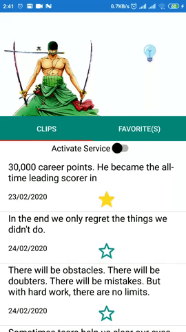
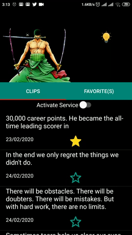
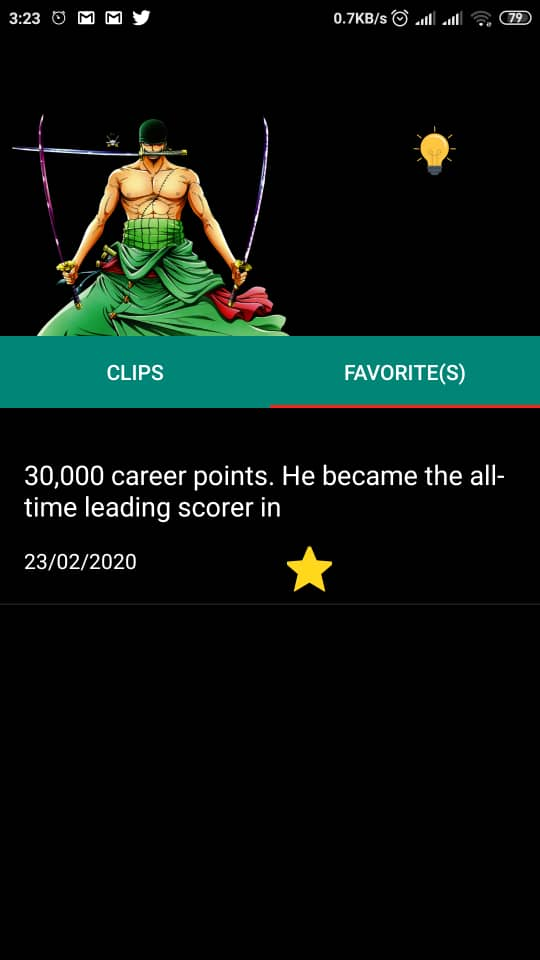

# ClipBoard-Manager

> For Android 10 users, apps cannot access clipboard data unless it’s the default input method editor (IME). In other words, only the current default keyboard can read from the clipboard and other apps running in the background can’t. The app works fine with previous versions. 

Clipboard managing app that makes it easy to access your clipboard history and to reuse any elements before by a simple click. Additional features are available such as :

| Day mode / Dark Mode      |  Swipe to delete |  Bookmark |
| ----------- | ----------- |----------- |
||||

## About

- User can save data from clipboard
- Day / Dark Mode
- User can bookmark favorite clips
- User can delete clips
- Date information is provided
- Clips are reusable with a single click

## Built With 🛠

- Java
- Android Architecture Components - Collection of libraries that help you design robust, testable, and maintainable apps.
    - LiveData - Data objects that notify views when the underlying database changes.
    - ViewModel - Stores UI-related data that isn't destroyed on UI changes.
- Room - A persistence library provides an abstraction layer over SQLite

NB: You have to activate the switch to enable the activation of the clipboar listener so that the app can save the texts that you will copy. To deactivate it, just press the notification or enter the app and click on the switch button.

## Licence

MIT License

Copyright (c) 2020 Rachid Insa

Permission is hereby granted, free of charge, to any person obtaining a copy
of this software and associated documentation files (the "Software"), to deal
in the Software without restriction, including without limitation the rights
to use, copy, modify, merge, publish, distribute, sublicense, and/or sell
copies of the Software, and to permit persons to whom the Software is
furnished to do so, subject to the following conditions:

The above copyright notice and this permission notice shall be included in all
copies or substantial portions of the Software.

THE SOFTWARE IS PROVIDED "AS IS", WITHOUT WARRANTY OF ANY KIND, EXPRESS OR
IMPLIED, INCLUDING BUT NOT LIMITED TO THE WARRANTIES OF MERCHANTABILITY,
FITNESS FOR A PARTICULAR PURPOSE AND NONINFRINGEMENT. IN NO EVENT SHALL THE
AUTHORS OR COPYRIGHT HOLDERS BE LIABLE FOR ANY CLAIM, DAMAGES OR OTHER
LIABILITY, WHETHER IN AN ACTION OF CONTRACT, TORT OR OTHERWISE, ARISING FROM,
OUT OF OR IN CONNECTION WITH THE SOFTWARE OR THE USE OR OTHER DEALINGS IN THE
SOFTWARE.
